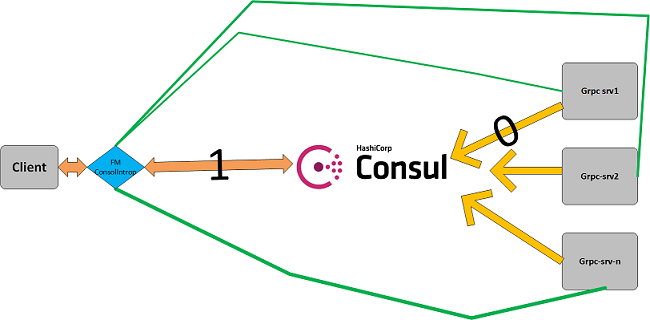
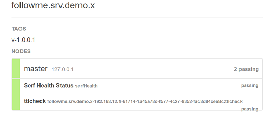

##  FM.ConsulInterop -a lib for simple build micro service 

## 解决了什么问题
- [解决了什么问题,怎么解决](./docs/intro.md)

## 依赖的技术栈
-  [dotnet standard 2.0]()
-  [gRPC - An RPC library and framework](https://github.com/grpc/grpc)
-  [consul-Service Discovery and Configuration Made Easy](https://consul.io)

## 组件交互图




## 功能
-  简化grpc-srv注册到consul的交互方式 (简单的配置文件/一个扩展方法)
-  简化grpc-client 消费grpc-srv的交互方式 (简单的配置文件/proxy模式)
-  客户端定时自动发现srv,并自动负载请求到srv 
-  客户端中间件(认证/log/timeout..)

## let's getting start

#### 如何启动:

[simples代码](./sample/)

1. 下载consul, 启动consul (当然也可以不用consul,客户端服务端同时指定非consul模式,客户端配置中直接指定service address的地址)
2. 修改samples/下面的[appsettings](./samples/SharedProject/appsetting.json)配置文件设置相关的consul地址,和srv-监听地址
3. 启动srv ,启动client

#####  客户端和服务端的配置文件详解


```json
{
  "consul": {
    "service": {  ##给srv用的节点
      "ServiceName": "followme.srv.demo.x",  ##注册到consul中的srv-name
      "ConsulAddress": "http://192.168.8.6:8500", ##consul服务地址
      "ServiceAddress": "192.168.*.*:0",  ## grpc服务需要监听的IP/port(这里使用*,可以自动的选择IP,在同网段中可以随意启动实例自动扩展)
      "ConsulIntegration": "true", ##是否需要把服务信息注册到consul中
      "ConsulTags": "v-1.0.0.1", ##tag 
      "TCPInterval": 10  ##这里使用的是consul中的TTL check模式,TTL时间(s)
    },
    "remotes": {
      "demo": {  #####这里是给客户端使用的节点
        "name": "demo.x",  ####准备遗弃的配置!
        "ServiceName": "followme.srv.demo.x", ####客户端需要消费的服务名(通过这个名字来找到相应的服务提供的地址)
        "FreshInterval": 10000,  #### 客户端需要定时的刷新服务列表,时间毫秒
        "ConsulAddress": "http://192.168.8.6:8500", ### consul的地址
        "ConsulIntegration": "true", ### 客户端是否需要从consul获取服务地址
        "ServiceAddress": "" ### 当ConsulIntegration=false的时候, 这里的地址可以配置服务的具体ip:port方式
      }
    }
	}
}
```
#### srv启动代码解析

```c#
var srvConfig = conf. GetSection("consul").GetSection("service").
Get<ConsulLocalServiceConfig>();
new Server
{
     Services = { FM.Demo.HelloSrv.BindService(new HelloSrvImp()) },
}.StartAndRegisterService(srvConfig).Wait();

//获取配置文件中配置的service节点
//通过使用扩展方法[StartAndRegisterService]来启动grpc-服务
//服务启动之后,查看consulUI中的相关界面信息,发现服务已经注册成功!
```



#### client消费srv代码解析
```c#

//通过配置文件获取client需要消费的那个srv组(因为srv可以同时启动多个)
var clientConfig = conf.GetSection("consul").GetSection("remotes").GetSection("demo").
                Get<ConsulRemoteServiceConfig>();

//FM.Demo.HelloSrv.HelloSrvClient 是grpc subclass(通过protoc工具生成)
//ClientAgent是封装了所有客户端调用的类
//负责做负载, 自动发现新的服务, 踢掉不能用的服务..
//通过ClientAgent来初始化clientProxy
var client =new ClientAgent<FM.Demo.HelloSrv.HelloSrvClient>(clientConfig);
//Hi是FM.Demo.HelloSrv.HelloSrvClient提供的元方法
client.Proxy.Hi(new FM.Demo.HiRequest());
```

## 了解内部log

可以通过如下的代码来查看内部的log细节

```c#
FM.ConsulInterop.InnerLogger.ConsulLog += (s, c) =>Console.WriteLine(c.Content);
```

## 如何贡献

- issue
- merge request

## license

 MIT


